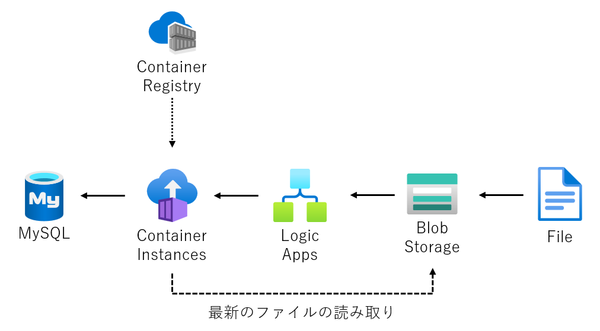
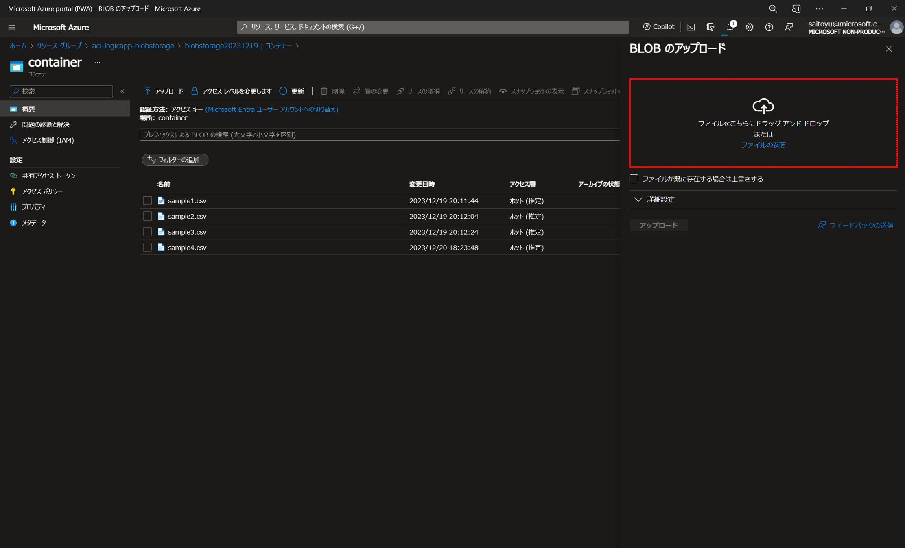
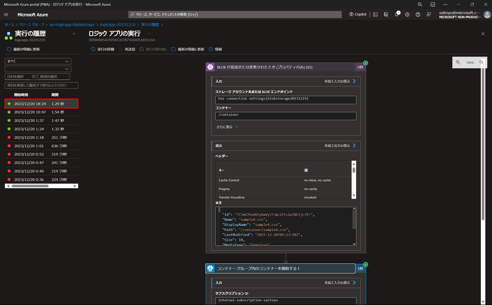
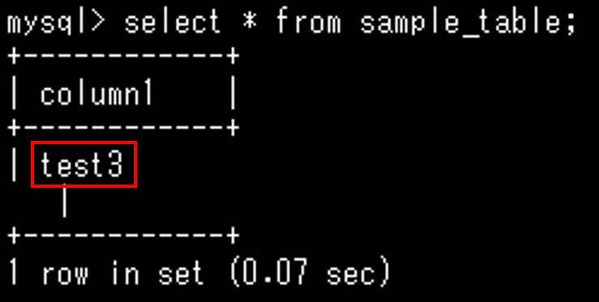

# システム概要
Blob Storage にデータ (csv を想定) が保存されたタイミングで、Logic Apps がContainer Instance のコンテナーを起動し、Blob Storage に保存されている最新のデータを Database for MySQL に書き込むシステムです。コンテナーで実行される関数は PHP で書かれています。

# 構成
以下が本システムの構成になります。


# デモ
以下に、実施したデモの Azure ポータルのスクリーンショットを載せます。

Blob Storage のコンテナーにファイルをアップロードします。


Logic Apps の実行の履歴より、ワークロードの実行が成功したことを確認します。


MySQL に接続し、保存したテーブルにアップロードしたデータの中身が書き込みされていることが確認できました。


# 下準備
index.php の <接続文字列>、<コンテナ名>、<ホスト名>、<データベース名>、<ユーザー名>、<パスワード> の中身を環境にあわせて変更

# ローカル実行
```
docker build . -t php74
docker run php74
```


# ACR へのイメージファイルの push
Azure にログイン
```
az login --tenant <tenantID>
```

Azure Container Registry インスタンスにログイン
```
az acr login --name <acrName>
```

Docker イメージを作成
```
docker build . -t php74
```

イメージファイルへのタグ付け
```
docker tag php74 <acrName>.azurecr.io/php74:v1
```

Azure Container Registry へのイメージのプッシュ
```
docker push <acrName>.azurecr.io/php74:v1
```

コンテナーのデプロイ
service-principal-ID と service-principal-password は ACR のアクセスキーから確認
```
az container create --resource-group <resourceGroupName> --name <aciName> --image <acrName>.azurecr.io/php74:v1 --cpu 1 --memory 1 --registry-login-server <acrName>.azurecr.io --registry-username <service-principal-ID> --registry-password <service-principal-password> --ip-address Public --ports 80 --restart-policy onFailure
```

## 参考記事
- チュートリアル:Azure コンテナー レジストリを作成してコンテナー イメージをプッシュする
https://learn.microsoft.com/ja-jp/azure/container-instances/container-instances-tutorial-prepare-acr

- チュートリアル: Azure Container Instances にコンテナー アプリケーションをデプロイする
https://learn.microsoft.com/ja-jp/azure/container-instances/container-instances-tutorial-deploy-app

# 留意事項
- 本ソースコードはサンプルになります。
- index.php の <接続文字列>、<コンテナ名>、<ホスト名>、<データベース名>、<ユーザー名>、<パスワード> の中身を環境にあわせて変更していただく必要があります。
- コンテナーのイメージファイルは Azure Container Registry に保存しています。